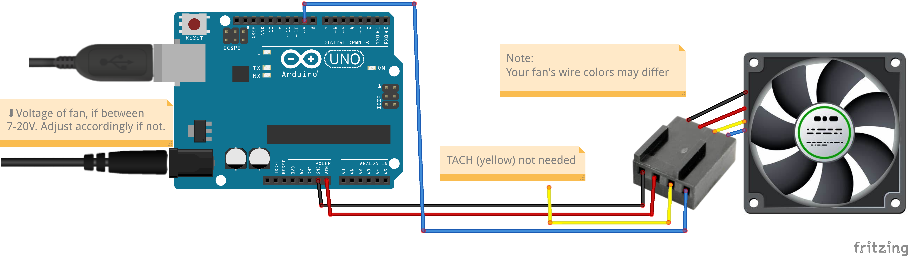

# Universal K80 Cooling

This is a Linux cooling control software, which uses an Arduino Uno, PWM fan, and Python 3. It was designed for use with a Tesla K80 (a datacenter GPU without fans), but should work with any NVIDIA GPU.

This will determine the speed your fan (connected to your Arduino) should run at based on the highest temperature 
between your GPUs, then will send that speed to your Arduino. 

Make sure to set the port in the .py file you use!

---

### How to use
1. Connect the Arduino to the fan according to this diagram:

2. **Set the port variable** 
   1. Instructions for finding the port are in the Python code.
3. Upload `Arduino/rx_speed.ino` to your Arduino Uno, then run `Python/tx_speed.py`.
   1. Make sure not to run the Python file until the Arduino sketch is done uploading! It should only take a few seconds.
5. Revel in your success!
   1. If you plan to use this constantly, make sure to create a service that starts the Python code on boot.

### My setup
I use [this](https://www.thingiverse.com/thing:4960323) 3D-printed fan adapter for my Tesla K80; I highly recommend it.

Also, I use [this](https://www.amazon.com/8025-DS08025R12U-0-7A-4Wire-Cooler/dp/B08PYLMGVM) fan. I wouldn't recommend buying it, though. I just use it because it's the most powerful fan I already had. It's also pretty loud.

In the long-term, I'm planning to build my own front cover for my PC case (a Corsair 175R), and will have a spot for my 
Arduino and wiring in it.

Pictures will be added later once my setup is complete. Don't expect it to happen anytime soon, though.

---

### Notes and Limitations:
 - This currently **only supports NVIDIA GPUs**
 - This currently **only supports normal PWM**, not delta PWM
 - You may need to change some variables in the Arduino code depending on your fan's specifications.
   - Try looking up a datasheet
 - This was designed for an Arduino Uno, and should work on one. I don't know about running it on anything else, though.
 - I'm busy, so a lot of the files are probably still broken. However, the main stuff is working.

---

### Resources I used
- Python-Arduino communications library - [pySerialTransfer](https://github.com/PowerBroker2/pySerialTransfer)
  - Thanks for the help figuring this out, [PowerBroker2](https://github.com/PowerBroker2)!
- Arduino PWM fan control - [25 kHz 4 Pin PWM Fan Control with Arduino Uno](https://create.arduino.cc/projecthub/tylerpeppy/25-khz-4-pin-pwm-fan-control-with-arduino-uno-3005a1)
  - This is the basis of my arduino-fan diagram
- See NVIDIA GPU temperatures - [GPUtil](https://pypi.org/project/GPUtil/)

---

### TODO
- Add diagram for wiring LED lights
